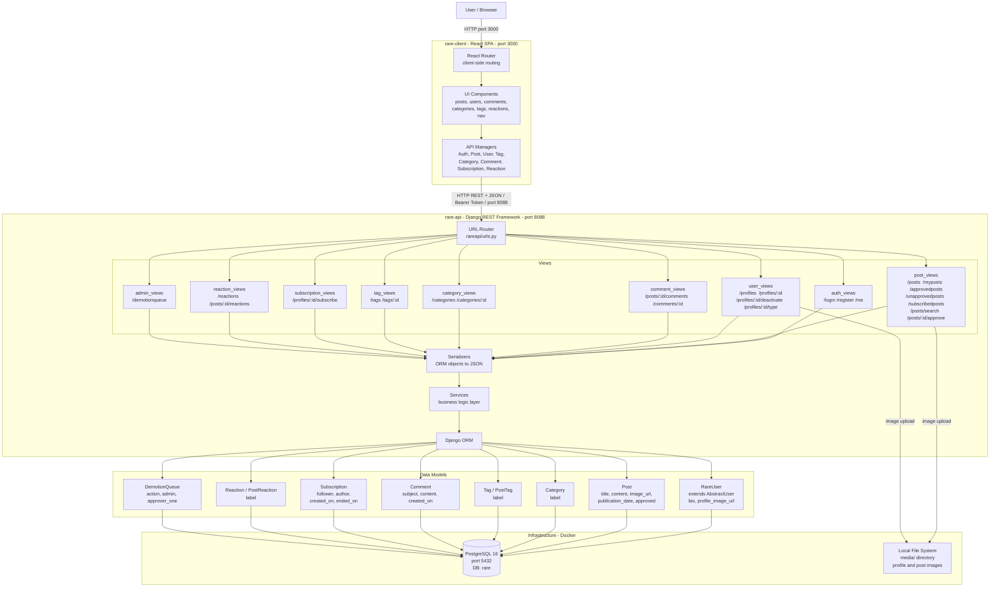

# System Architecture

## Overview

RARE is a content publishing platform (similar to Medium) built as a two-tier monolith: a React SPA frontend communicates with a Django REST API backend backed by a single PostgreSQL database.

## System Architecture Diagram

## Component Descriptions

| Component | Technology | Responsibility |
|---|---|---|
| **rare-client** | React 18, React Router 6, Bulma CSS | Single-page application; handles all UI and client-side routing |
| **API Managers** | Native `fetch()` | Thin HTTP client modules; attach Bearer token from `localStorage` and map to REST endpoints |
| **rare-api** | Django 4.2, Django REST Framework 3.15 | REST API server; enforces authentication, applies business logic, serializes responses |
| **URL Router** | Django URLconf | Maps URL patterns to view handlers |
| **Views** | DRF `APIView` subclasses | One module per domain (posts, users, comments, etc.); handles auth and permissions |
| **Serializers** | DRF `ModelSerializer` | Convert ORM model instances to/from JSON |
| **Services** | Plain Python | Isolate complex business logic (e.g., approval workflow, subscription feed) from views |
| **Django ORM** | Django ORM | Translates Python model operations to SQL queries |
| **PostgreSQL 16** | Docker container | Single relational database; all domain data |
| **Local File System** | Django `media/` | Stores uploaded profile and post images; served as static files in development |

## Key Flows

### Authentication
1. Client POSTs credentials to `/login` → API returns a DRF `Token`
2. Token stored in `localStorage`; every subsequent request includes `Authorization: Token <token>`
3. Admin users (`is_staff=True`) have posts auto-approved; regular users' posts enter a moderation queue

### Post Approval Workflow
1. Regular user creates a post → `approved=False`
2. Admin visits `/unapprovedposts` and calls `POST /posts/:id/approve`
3. Post becomes visible in `/approvedposts` and the subscription feed

### Image Uploads
- `PATCH /posts/:id/image` and `PATCH /profiles/:id/image` accept multipart form data
- Files are written to `rare-api/media/` on the server's local file system
