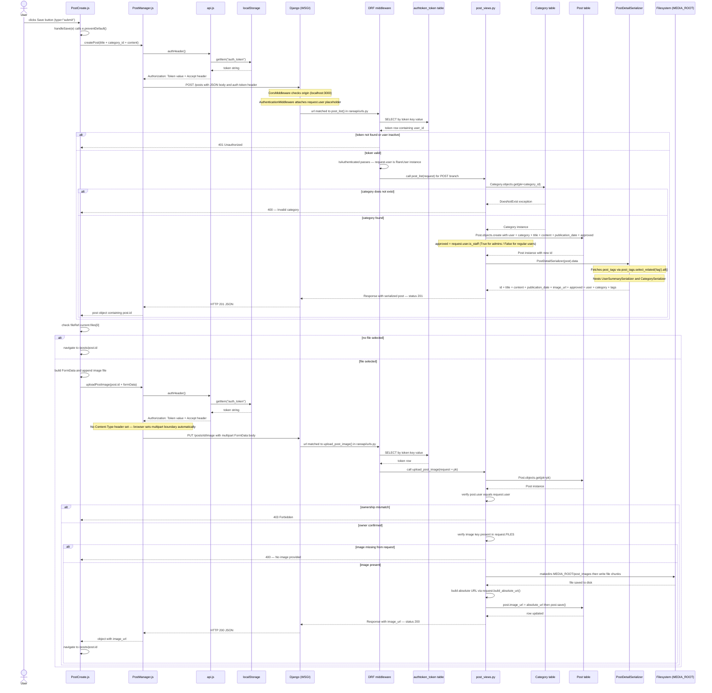

# Create Post Sequence Diagram

Traces what happens from the moment a user clicks **Save** on the New Post form through to the database, including the optional image upload branch.

## Participants

| Participant | File |
|---|---|
| `PostCreate.js` | [rare-client/src/components/posts/PostCreate.js](../../rare-client/src/components/posts/PostCreate.js) |
| `PostManager.js` | [rare-client/src/managers/PostManager.js](../../rare-client/src/managers/PostManager.js) |
| `api.js` | [rare-client/src/managers/api.js](../../rare-client/src/managers/api.js) |
| `post_list()` / `upload_post_image()` | [rare-api/rareapi/views/post_views.py](../rareapi/views/post_views.py) |
| `PostDetailSerializer` | [rare-api/rareapi/serializers/post_serializers.py](../rareapi/serializers/post_serializers.py) |
| URL routing | [rare-api/rareapi/urls.py](../rareapi/urls.py) |
| `Post` model | [rare-api/rareapi/models/post.py](../rareapi/models/post.py) |

## Key behaviours

- **Token auth**: DRF's `TokenAuthentication` resolves the `Authorization: Token <value>` header against the `authtoken_token` table on every request.
- **Moderation**: `approved` is set to `request.user.is_staff` at creation time — admin posts publish immediately, regular-user posts enter the moderation queue (`approved=False`).
- **Image upload is a separate request**: `createPost` returns first (HTTP 201), then `uploadPostImage` fires a `PUT` to `/posts/{id}/image` only if the user selected a file. The image is written to `MEDIA_ROOT/post_images/` and the absolute URL is persisted back to `post.image_url`.
- **Navigation**: the React component redirects to `/posts/{id}` after both requests complete (or after the first if no file was selected).
