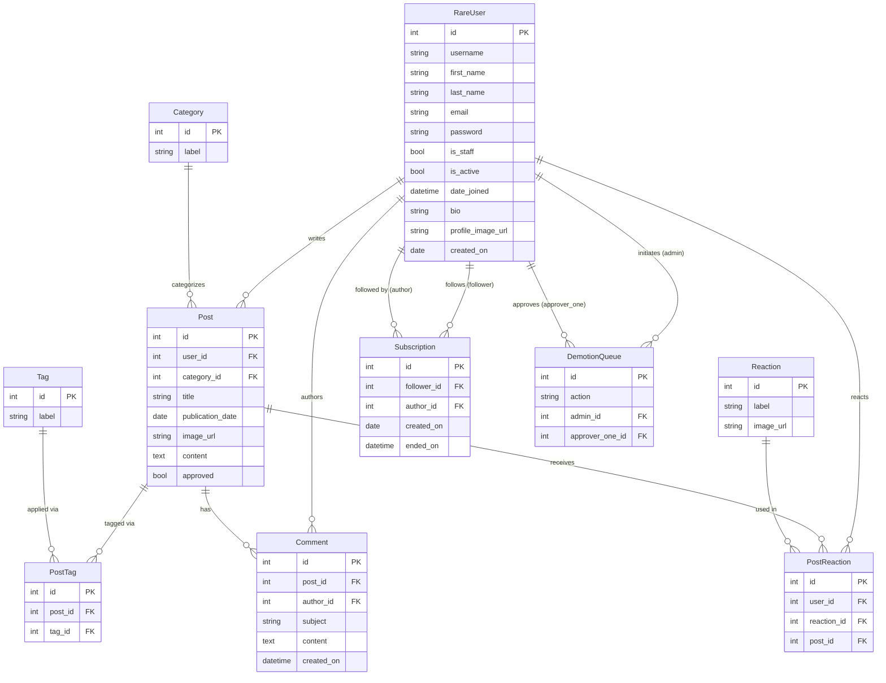

# Database Schema

```mermaid
erDiagram
    RareUser {
        int id PK
        string username
        string first_name
        string last_name
        string email
        string password
        bool is_staff
        bool is_active
        datetime date_joined
        string bio
        string profile_image_url
        date created_on
    }

    Category {
        int id PK
        string label
    }

    Post {
        int id PK
        int user_id FK
        int category_id FK
        string title
        date publication_date
        string image_url
        text content
        bool approved
    }

    Comment {
        int id PK
        int post_id FK
        int author_id FK
        string subject
        text content
        datetime created_on
    }

    Tag {
        int id PK
        string label
    }

    PostTag {
        int id PK
        int post_id FK
        int tag_id FK
    }

    Reaction {
        int id PK
        string label
        string image_url
    }

    PostReaction {
        int id PK
        int user_id FK
        int reaction_id FK
        int post_id FK
    }

    Subscription {
        int id PK
        int follower_id FK
        int author_id FK
        date created_on
        datetime ended_on
    }

    DemotionQueue {
        int id PK
        string action
        int admin_id FK
        int approver_one_id FK
    }

    RareUser ||--o{ Post : "writes"
    RareUser ||--o{ Comment : "authors"
    RareUser ||--o{ PostReaction : "reacts"
    RareUser ||--o{ Subscription : "follows (follower)"
    RareUser ||--o{ Subscription : "followed by (author)"
    RareUser ||--o{ DemotionQueue : "initiates (admin)"
    RareUser ||--o{ DemotionQueue : "approves (approver_one)"

    Category ||--o{ Post : "categorizes"

    Post ||--o{ Comment : "has"
    Post ||--o{ PostTag : "tagged via"
    Post ||--o{ PostReaction : "receives"

    Tag ||--o{ PostTag : "applied via"

    Reaction ||--o{ PostReaction : "used in"
```
